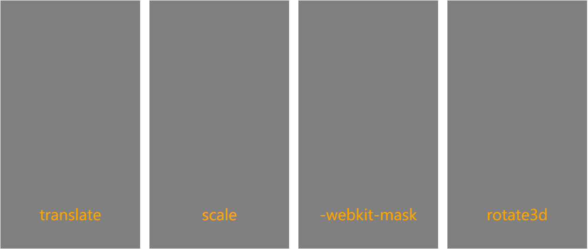
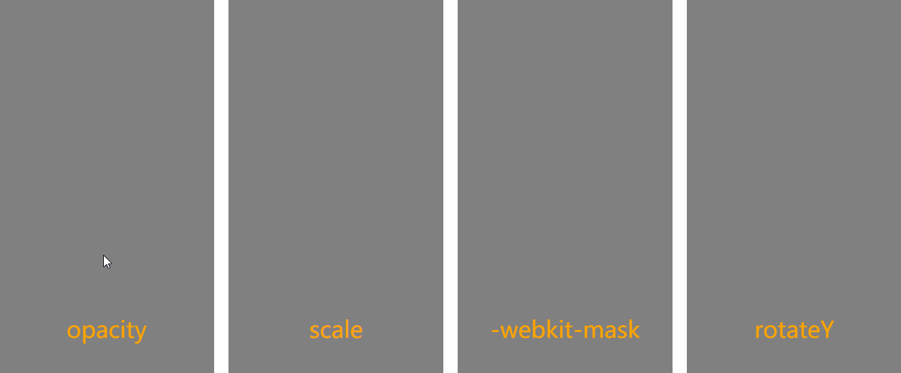

# 动效库
用以整理各类动画理论和展示简单动画效果，交流为主。  
案例：https://foreverZ133.github.io/mine-anim/

## 动画常见修改属性
位置、旋转(包括3D)、缩放(包括单轴)、斜切、透明度、换图、颜色(字/背景/边框)

## 动画节奏（比如先快后慢）
二级、多级贝塞尔曲线

## 动画分类
显隐类、普通类、图形类、多元素类、帧动画

## 显隐类动画类型
普通型、形变型、蒙版裁剪型、3D型  
// 例子，从右侧划出  

// 例子2，弹窗出现

## 显隐类动画场景类型
转场、界面/弹窗、交互之后、

## 普通类
抖动、闪烁、Q弹  
// 例子，摇摆

## 图形类
简单点的，修改属性基本是一致的  
也可以很复杂，多基于 SVG 或 canvas 来实现  
// 例子，变化的 logo

## 多元素类
延迟跟随、数量变化

---- 

### 需要注意的问题
* 案例涉及 CSS、SVG、canvas 等多种实现技术，也正代表着每个案例不只一种解决办法。  
* 本案多以 z-index:-1 和 pointer-events:none 来替代 display:none 实现隐藏，个人认为性能更加。  
* transfrom 在移动端可能出现莫名超出，注意将其父级或祖父级 overflow 一下。  